zTracker'
=========

zTracker is a MIDI tracker / sequencer modeled after Impulse Tracker / Scream Tracker. It was originally Win32 only but now it's been upgraded to 64-bit systems and works on Windows, macOS and Linux.


This fork is released as a homage to the original work of Chris Micali. I have been using zTracker nearly on a daily basis for the past 24 years. As the original project has remained untouched since 2002, at some point I started tinkering with the source code, at first to fix bugs and later to change how the program behaves.

I don't know if there are any zTracker users remaining out there, but as I'm preparing to try a big overhaul of this software that could potentially end as a whole new program, this is released with the hope that someone can find it useful.

*Please be advised that I can't guarantee this version works better for you than the original*

Everyone does have his own tastes, routines and circumstances. zTracker' behaves nearly flawlessly for me and I like it better than the original. But in your case this could be a different history. It is a good idea to check the following list to understand what this fork is about.

There's also the possibility that I misunderstood how something worked and "fixing" it I broke it, or that I have changed the way something works that could have been activated by just pressing a key. Who knows?


Pages and views
---------------

A tour of every page zTracker' currently has, in the order you'll typically meet them. All screenshots below were rendered headlessly by `zt --headless --script tests/scripts/all-pages.txt` (see `docs/headless-script.md` and PR #98). To regenerate them after a UI change:

```sh
mkdir -p docs/screenshots
./build/Program/zt --headless --script tests/scripts/all-pages.txt
```

### Pattern Editor — `F2`

The home base. Every track is a vertical column of `note · instrument · volume · effect` events; horizontal motion picks the column, vertical motion picks the row. Multi-channel MIDI out, real-time BPM/TPB changes, the row-highlighting + lowlighting that lets you stay oriented in non-4/4 patterns, the Replicate / Clone / Humanize / Interpolate operations ported from Paketti, the `Ctrl+Shift+§` CC drawmode that records incoming MIDI CC into pattern rows as `Sxxyy` effects.

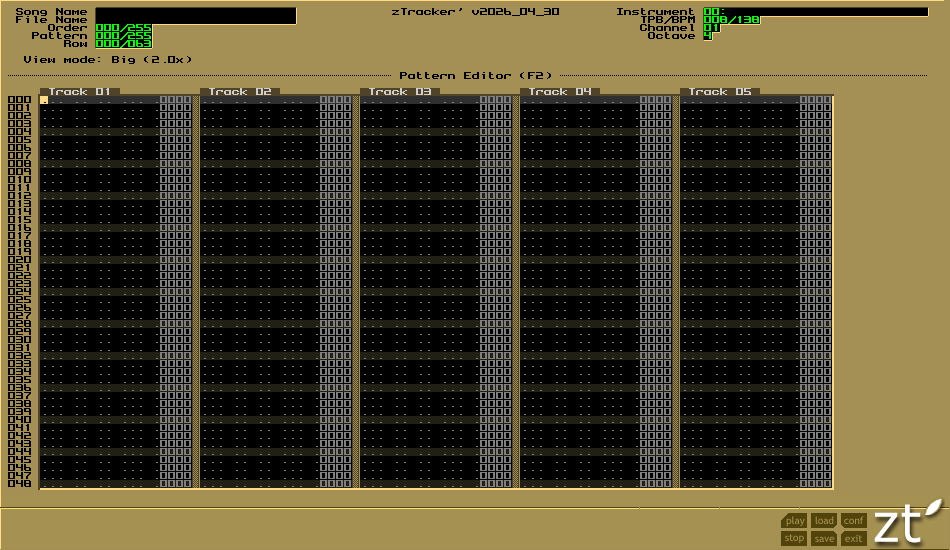

### Help — `F1`

Section-aware help text covering every shortcut. F1 toggles in/out of Help; Tab / Shift+Tab jump between section headers. On macOS, every `CTRL-X` line in the source `doc/help.txt` is rewritten on the fly to the uniform `CMD-X/ALT-X` form so users see the macOS-natural and the cross-platform-portable modifiers in the same line.

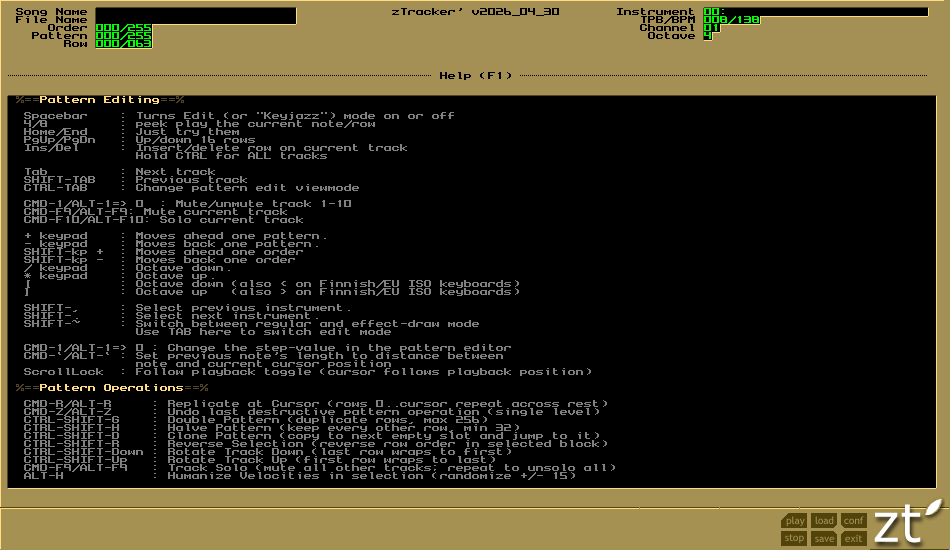

### Instrument Editor — `F3`

Per-instrument MIDI device, channel, program, bank-select, transpose, and the per-instrument CCizer Bank assignment that ties an instrument to a specific Paketti `.txt` (so the CC Console at Shift+F3 auto-loads the right slider set when you change instruments).

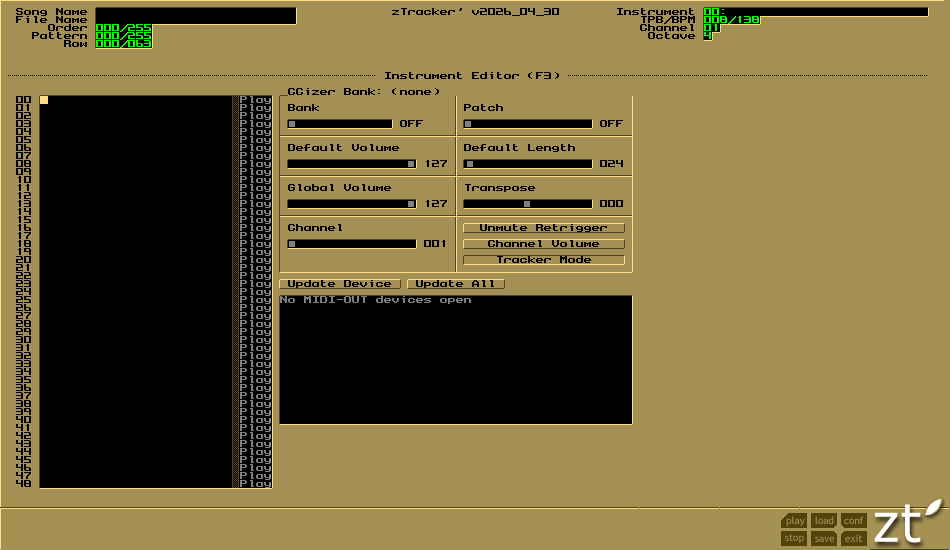

### MIDI Macro Editor — `F4`

Edit the 16 user-defined macros that the pattern `Z` effect dispatches. Bundled presets (CC #1 Modulation, CC #74 Filter Cutoff, Program Change, Pitch Bend Coarse, All Notes Off, …) load via the inline preset list — Tab to focus, arrows + Enter / Space, P to cycle. A macro whose name ends in `.syx` is dispatched as a SysEx file send instead — the data grid is ignored.

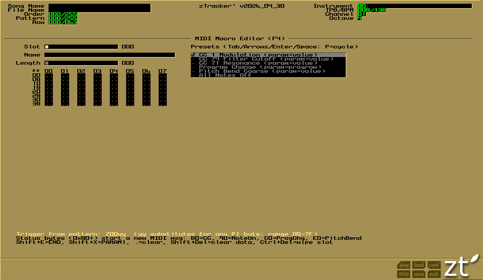

### Arpeggio Editor — `Shift+F4`

The 16 arpeggio slots that the pattern `R` effect plays back. Slot / Name / Length / Speed / Repeat / NumCC + the per-step pitch grid. Bundled presets (Major Triad Up, Octave Bounce, Trill, Chord, scales, …). The Keyjazz panel below the grid lets you audition steps directly via QWERTY note row.

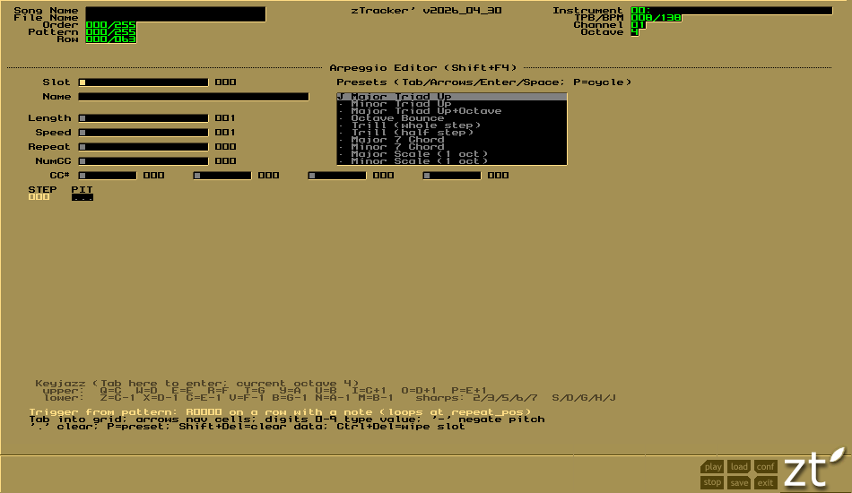

### Shortcuts & MIDI Mappings — `Shift+F2`

The unified keybindings + MIDI-mappings page. Each action shows its bound key and up to three MIDI Learn slots side by side. UP/DN/L/R move the cursor; Enter on a Keyboard cell starts a key-capture session; Enter on a MIDI cell starts a MIDI Learn session; DEL clears the focused cell; Ctrl+S writes everything (keyboard + MIDI) to `zt.conf`.

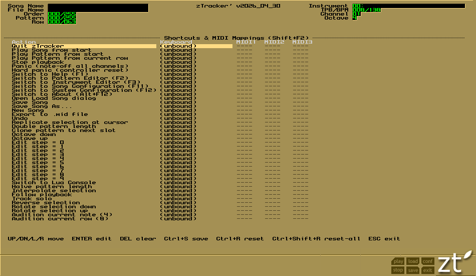

### CC Console — `Shift+F3`

Paketti CCizer file picker on the left, slider/knob grid on the right. Loading a `.txt` parses the slot definitions; each slot becomes a real ValueSlider widget (mouse-clickable, keyboard-adjustable). Tweaking a slider sends its CC (or 14-bit Pitch Bend, for `PB` slots) on the current channel. `L` enters MIDI Learn for the focused slot; `B` assigns the loaded file as the current instrument's CCizer Bank.

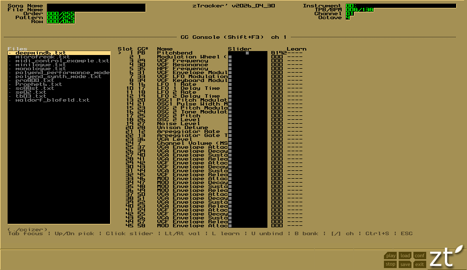

### SysEx Librarian — `Shift+F5`

Pick a `.syx` file with Up/Dn, press Enter (or Space, or S) to send it out the current MIDI Out. Synth responses are auto-captured: every received SysEx is written to `recv_<TS>.syx` in the same folder and the on-screen "Recent receive" pane shows time / length / a hex preview of each. R rescans the folder; C clears the receive log.

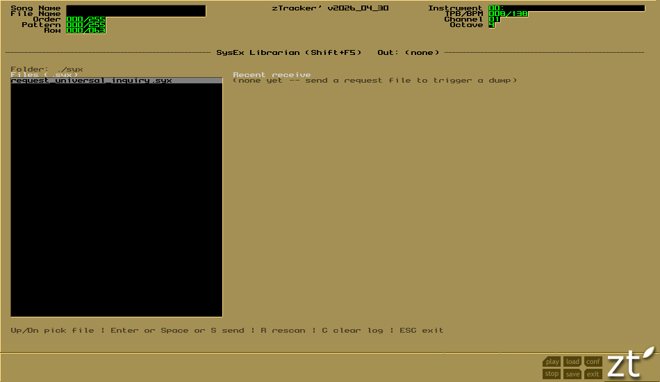

### Song Message — `F10`

Free-form notes attached to the song. Saved into the `.zt` file, useful for chord charts, arrangement notes, or just liner notes for the future-you who opens the file three years later.

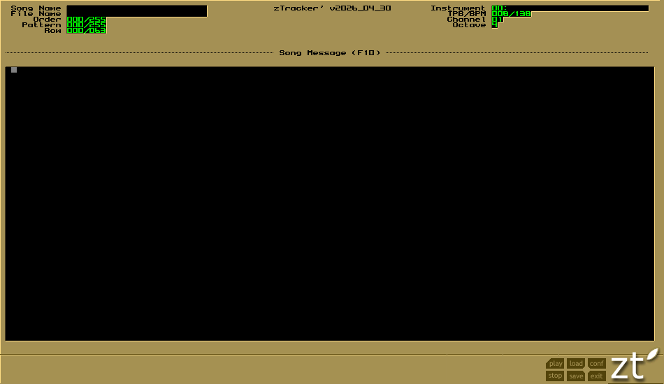

### Song Configuration — `F11`

Per-song settings: title, BPM, TPB, Send MIDI Clock, Send MIDI Stop/Start, MIDI In Sync (slave to incoming Start/Stop/Continue), Chase MIDI Tempo (slave BPM to incoming `0xF8` MIDI Clock), row Highlight / Lowlight increments. The right column is the Order List — the song's playback sequence of pattern indices.

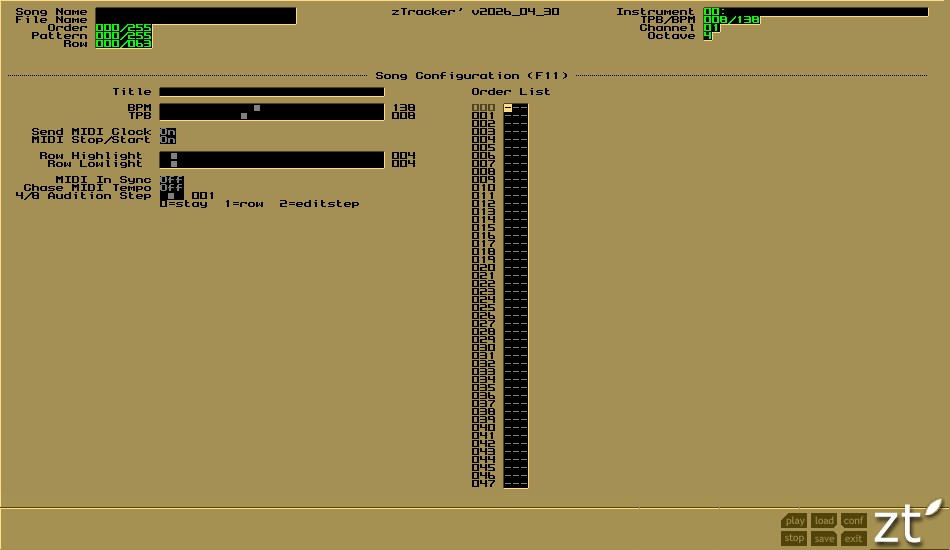

### System Configuration — `F12`

zTracker'-wide settings: Prebuffer, Panic on Stop, Auto-open MIDI, Full Screen, Record Velocity, the CCizer / SysEx folder paths, Skin Selection, MIDI In + MIDI Out Device Selection, per-device Latency / Reverse Bank Select / Device Alias. "Go to page 2" jumps to the second config page.

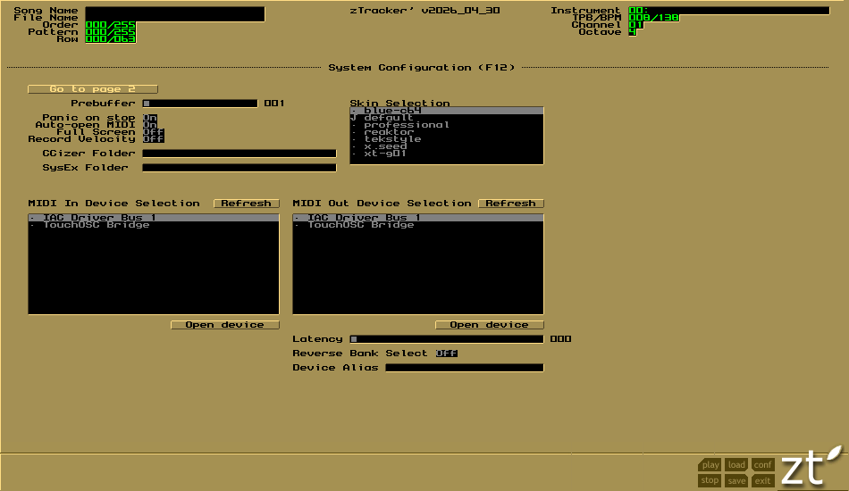

### Global Configuration — `Ctrl+F12`

The page-2 config: Auto-open MIDI ports, Autoload song, Default Directory, Record Velocity, Autosave interval, View Mode, row Highlight / Lowlight increments, Default Pattern Length, MIDI In Sync, Chase MIDI Tempo, and Post-Load Page (which page you land on after a successful load).

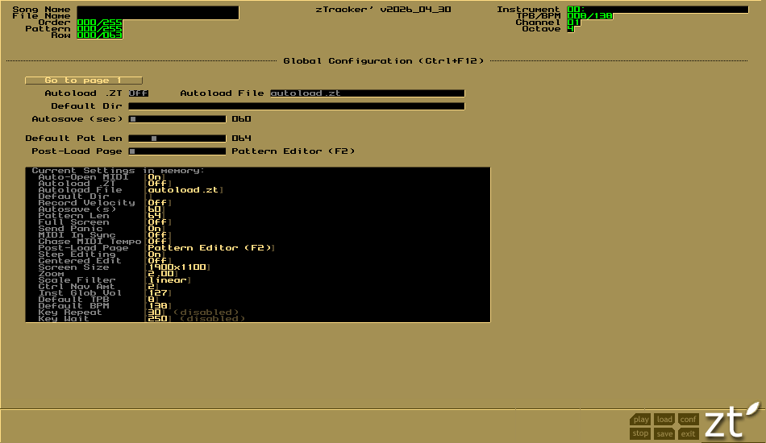

### Palette Editor — `Ctrl+Shift+F12`

Live colour editing of the active skin. Pick a swatch, edit R/G/B with arrow keys, see the change apply across every page in real time. Seven preset palettes ship plus the per-skin `colors.conf`. Global Brightness / Contrast / Tint sliders compose on top of the snapshot so they're reversible.

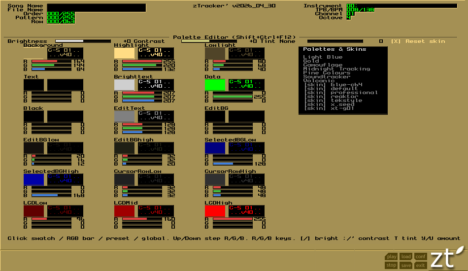

### About — `Alt+F12`

Credits, project links, version string. The version string includes the build date so you can tell at a glance which binary you're running.

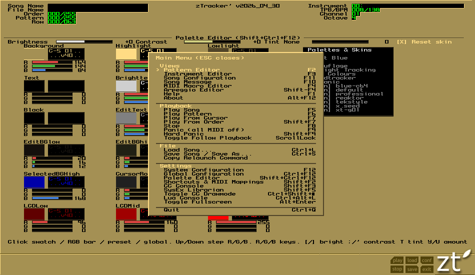

### Load — `Ctrl+L`

The file picker. Shows `.zt` and `.mid` files side by side, full-height list, double-click or Enter to load. Pressing Up at the first row cycles focus to the previous control; the cursor never lands outside the visible region.

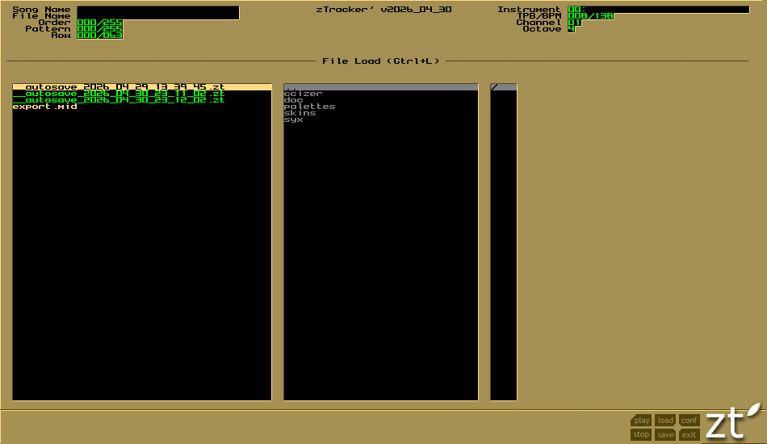

### Lua Console — `Ctrl+Alt+L`

Interactive Lua REPL with tab completion and a full API listing on open. Lets you script zTracker's internals — pattern operations, batch MIDI ops, automation around the file format. Output scrolls; the prompt accepts multi-line statements.

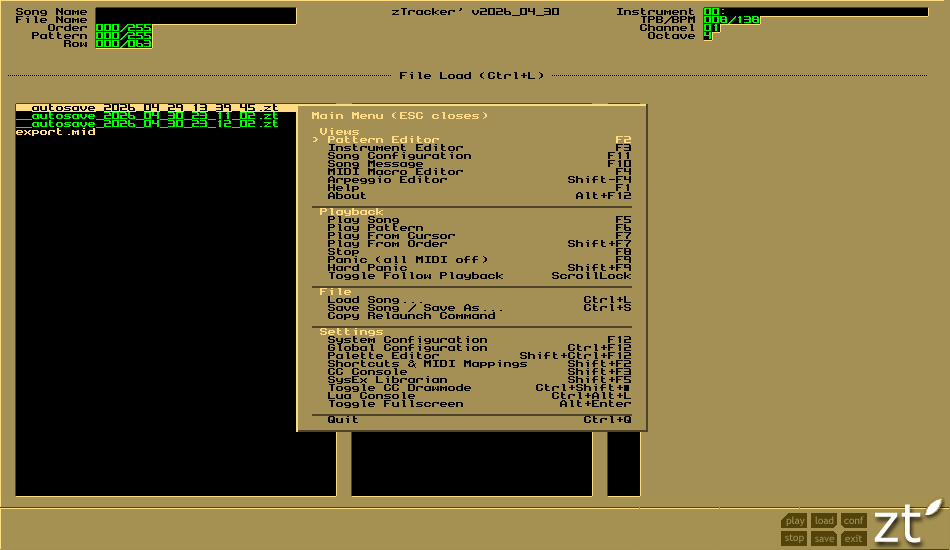

### Main Menu — `ESC`

A Schism Tracker-style overlay listing every page and common action with its keyboard shortcut. Cursor up/down to navigate, Enter to fire, ESC to close. You don't have to memorise the F-key map — every page is one ESC + arrows + Enter away.

The menu also includes a **"Window Size & Zoom"** section with six presets that change the on-screen window size, the zoom factor, and the internal canvas resolution in one keystroke — see the section below.

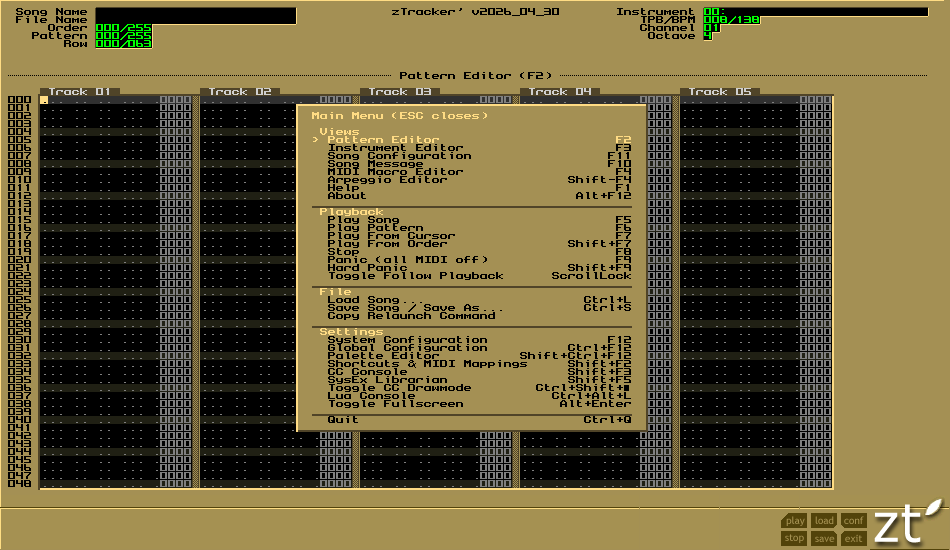

The screenshots above are checked in; CI doesn't currently regenerate them, so a UI change should be paired with a re-run of the smoke script + a re-commit of the affected PNGs. The headless harness (`--headless --script`) makes that ~30 seconds of work.


Window size & zoom presets
--------------------------

The ESC menu's **"Window Size & Zoom"** section lets you pick a window dimension + zoom factor without leaving the keyboard. Each preset sets three things at once:

- **Window pixel size** — the SDL window's dimensions on your monitor.
- **Zoom factor** — how big each 8×8 character cell appears physically (`8 × zoom` screen pixels per char).
- **Internal canvas** — `window / zoom`. This is the logical pixel grid the pages lay out into; bigger internal = more pattern rows, more tracks visible side-by-side, more slot rows in the CCizer / SysEx Librarian / palette editor.

The six presets sweep from a compact tiling-WM-friendly 1024×640 to a HiDPI 2560×1440 with 24-pixel chars. Each is rendered headlessly via the harness from PR #98:

| Preset | Window | Zoom | Internal | Char on screen |
|---|---|---|---|---|
| Compact   | 1024×640  | 1.0× | 1024×640  |  8 px |
| Default   | 1280×800  | 1.0× | 1280×800  |  8 px |
| Medium    | 1440×900  | 1.5× |  960×600  | 12 px |
| Large     | 1920×1080 | 2.0× |  960×540  | 16 px |
| Huge      | 2560×1440 | 2.0× | 1280×720  | 16 px |
| Massive   | 2560×1440 | 3.0× |  853×480  | 24 px |

(The Massive preset's internal resolution clamps to `MINIMUM_SCREEN_WIDTH × MINIMUM_SCREEN_HEIGHT = 840×480` because `2560 / 3 ≈ 853 < 840` width-wise. The character cell is still 24 screen pixels tall — the clamp only affects the logical grid size, not the on-screen char size.)

The change is applied *after* the current frame finishes (deferred via a one-shot pump in `main.cpp`'s render loop) so the popup's `update()` doesn't pull the rug out from under the active `Drawable*` mid-frame. The new size persists into `zt.conf` so the next launch starts at your chosen preset.

#### Compact 1024×640 (1.0×)

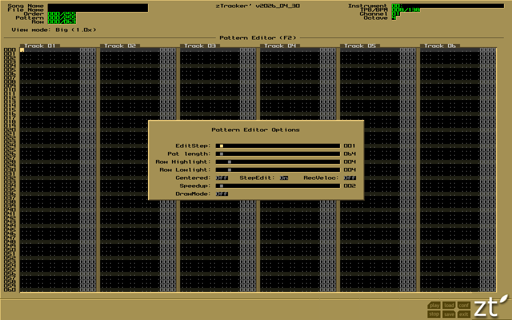

#### Default 1280×800 (1.0×)

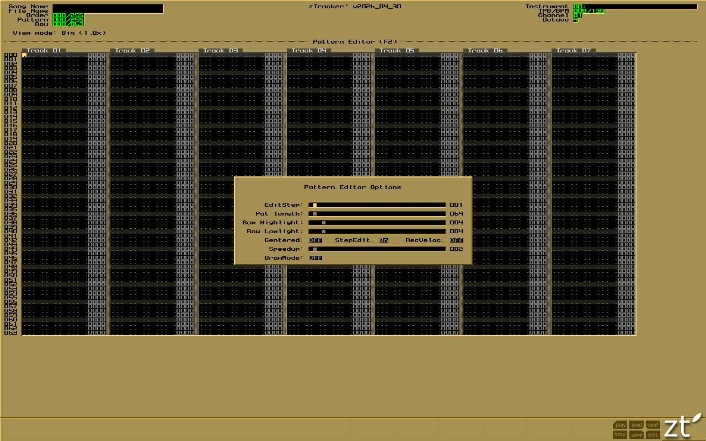

#### Medium 1440×900 (1.5×)

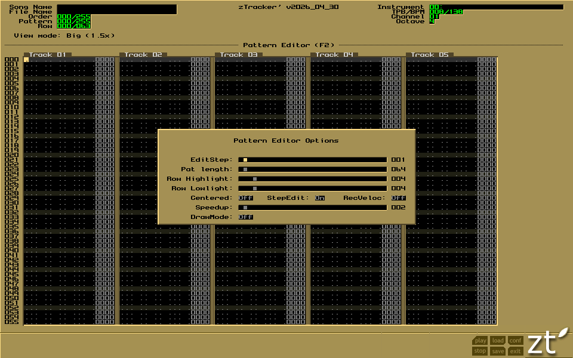

#### Large 1920×1080 (2.0×)

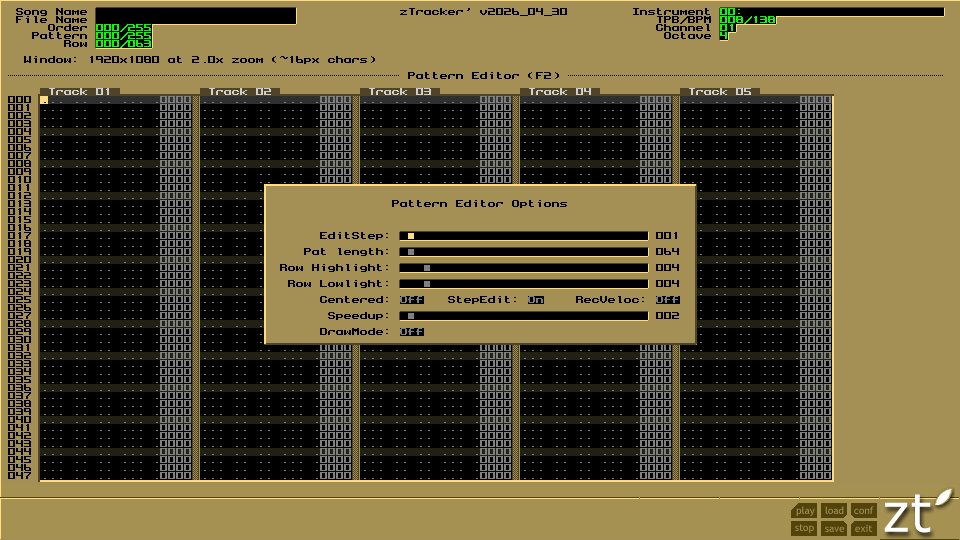

#### Huge 2560×1440 (2.0×)

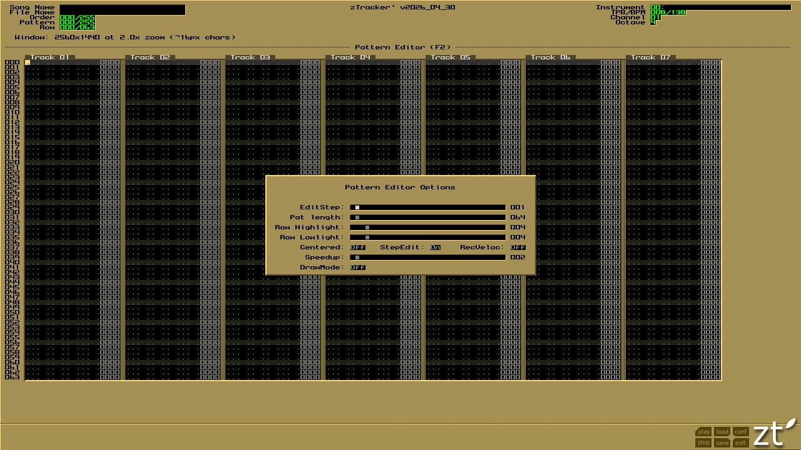

#### Massive 2560×1440 (3.0×)

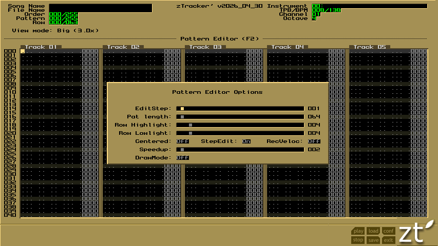


Builds and downloads
--------------------

CMake-based, cross-platform CI runs on every push and PR for Linux x86_64, Windows x64 (MSVC), Windows x86 (MinGW, XP-compatible), macOS arm64 and macOS x86_64. Pushing a `v*` tag also packages the binaries into a draft GitHub Release with `.tar.gz` / `.zip` / `.dmg` artifacts ready for download.

External libraries (zlib, libpng, SDL3, Lua) are vendored and statically linked — there are no DLLs to ship next to the executable. SDL3 on macOS comes from Homebrew (`brew install sdl3`); on Windows and Linux it is built/linked through the CI matrix.


So, what's new / different from the original zTracker? Here's a somewhat complete (but not really complete) list of the most important changes:


Program behavior changes:

- Support for laptop keyboards: The two right most keyboard keys after 'i', 'o', 'p' have been remapped to duplicate the octave up and down keys functionality. The two keys below now also go to the previous or next pattern (These have been tested only on Spanish keyboards for now)

- Note keys use layout-independent SDL scancodes, so the QWERTY/AZERTY/QWERTZ row positions trigger the right notes regardless of the host keyboard layout.

- Finnish / EU ISO keyboard support: the `§` key (top-left, scancode `NONUSBACKSLASH` / `INTERNATIONAL1..3`) is mapped to Note Off, and Shift+`§` toggles drawmode. The `<` / `>` key (left of Z on ISO Macs) is mapped to the bracket-key octave controls.

- Support for 1bpp PNG files in the skin fonts.

- Zoom mode enables the program to work in 2x, 3x, 4x... So it's useable again on high resolution screens.

- Resizeable window allows for a much more convenient experience. Mouse-wheel zoom preserves the window size — no more accidental resizes.

- Full-screen toggle (Alt+Enter) works again, including on macOS.

- Many shortcuts have been modified to use ALT key instead of Control (selections, etc).

- Channel enable / disable controls work with F keys row instead of the numbers row.

- The first 16 instruments get that MIDI channel assigned instead of defaulting to 0.

- BPM/TPB changes are now applied in real-time while playing a song or pattern.

- Song play view shows more information per note.

- Starts in "Tracker Mode" by default.

- After playing a song or pattern the instrument editor shows used instruments with a small dot '·' on the left side.

- Playing the current row only plays non silenced channels.

- Cursor steps when playing the current note / row with '4' and '8' keys.

- Page Up/Down move the cursor 4 highlighted rows instead of fixed 16, making it useful when working in non 4/4 time measures.

- Default pattern size is 64 instead of 128.

- Program doesn't allow the user to set a resolution lower than 1024x700 and will increase the X, Y or both of them if necessary.

- Play view draws as many channels as it can fit within the horizontal resolution, instead of a fixed number of them.

- Load and Save screens now use all the available space to display their list entries, and have an improved X size. The file list shows `.mid` files alongside `.zt`.

- After a successful load you land on the Instrument Editor (F3) by default. The destination is configurable in Global Config (Ctrl+F12 → Post-Load Page) — pick Pattern Editor (F2) or Song Configuration (F11) instead if you prefer.

- Auto-save: songs are auto-saved every N seconds (configurable in Global Config; default 60 s). Set to 0 to disable.

- Status messages no longer bleed across pages — switching pages clears the previous page's status line.

- Many more.


New pages and editors:

- **Main menu (ESC)** — pressing ESC anywhere overlays a Schism Tracker-style menu listing every page and common action with its keyboard shortcut. Cursor up/down to navigate, Enter to fire, ESC to close. You don't have to memorise the F-key map.

- **Keybindings Editor (Ctrl+Alt+K)** — view and rebind every keyboard shortcut in the app. Bindings are saved to `zt.conf` with Ctrl+S.

- **Lua Console (Ctrl+Alt+L)** — interactive Lua REPL with tab completion and a full API listing on open. Lets you script zTracker's internals.

- **Palette Editor (Shift+Ctrl+F12)** — live color editing of the current skin with seven presets. Changes apply immediately and save with the skin.

- **Song Message editor (F10)** — re-enabled and supports text input and Backspace / Enter / arrows.

- **Midimacro Editor (Ctrl+M)** — bound to plain Ctrl+M; MIDI export now lives at Ctrl+Shift+M.

- **About page (Alt+F12)** — credits, version, project links.


Pattern editing additions:

- **Replicate at Cursor / Clone Pattern** — quality-of-life pattern operations ported from Paketti.

- **Humanize Velocities** — randomise note velocities by ±N to take the rigid edge off programmed parts.

- **Interpolate (Ctrl+I)** — interpolate values across a selection (note, vol, or fx param), with a sensible fallback when no selection column applies.

- **Multichannel MIDI export** — exporting `.mid` writes one track per channel instead of flattening everything onto one track.

- **Centered editing mode** — keep the current row pinned at the centre of the pattern view as the cursor moves.

- **Step editing** — toggleable.

- **Highlight / Lowlight rows** — independent increments, both configurable in Global Config.


MIDI realtime and clock:

- **Send MIDI Clock** and **Send MIDI Stop/Start** — toggleable per song (Songconfig F11) and project-wide default (Sysconfig F12 / Global Config Ctrl+F12).

- **MIDI In Sync** — slave zTracker's transport to incoming MIDI Start/Stop/Continue.

- **Chase MIDI Tempo** — when MIDI In Sync is on, slave the BPM to incoming `0xF8` MIDI Clock so external sequencers / DAWs drive the tempo.

- **Send Panic on Stop** — toggle whether stopping playback also sends an All Notes Off panic.

- **Auto-Open MIDI** — open the configured MIDI ports at startup.


Configuration:

- **Most settings now have a UI**. The Sysconfig page (F12) handles the MIDI device list, and Global Configuration (Ctrl+F12, two pages) covers Auto-Open MIDI, Autoload, Default Directory, Record Velocity, Autosave interval, View Mode, Highlight / Lowlight increment, Default Pattern Length, MIDI In Sync, Chase MIDI Tempo, and Post-Load Page. Hand-editing `zt.conf` is no longer required for day-to-day use.

- The values still persist in `zt.conf` — the new GUI just gives you a way to change them without leaving the program.


Help text:

- **F1 toggle** — pressing F1 from Help returns you to the previous page.

- **macOS modifiers** — on macOS, every `CTRL-X` shortcut in `doc/help.txt` is rewritten on the fly to the uniform `CMD-X/ALT-X` form so users see both the macOS-natural and the cross-platform-portable modifiers in the same line. Continuation lines are re-indented to stay aligned with the rewritten description.

- **Section-aware nav** — Tab / Shift+Tab in the Help screen jump between section headers; Shift+Tab from the first section wraps to the last.


Fixed bugs:

- Many crashes have been fixed - Works rock solid now.

- Many memory bugs have been fixed (reading from uninitialized variables et al).

- File requester didn't show `.mid` files; now it does.

- Control + L to load and Control + S to save work again.

- Using F6 to play current pattern now works even if it's not included in the song order list.

- Scroll didn't move when playing individual notes and rows.

- Current pattern being edited didn't display correctly the row numbers if it had a different count than the default.

- Last line remained highlighted when play entered the current pattern then exited to another.

- You could use the numeric keypad '+' to advance the song position, but couldn't use the '-' to rewind it.

- F5 / Play Song view track-header rows now align with the Pattern Editor (F2) — switching between F2 and F5 no longer shifts the pattern body.

- About page text box height is clamped so it can never overlap the bottom toolbar at non-default resolutions.

- Order List: pressing Up while at row 0 cycles focus back to the previous control (e.g. MIDI Stop/Start), matching the Down-into-the-list path.

- Songconfig: Title / BPM / TPB labels right-align with the field/slider start, and the Title field is the same width as the BPM/TPB sliders.

- Cursor no longer ends up outside the visible area when resizing the window.

- Compiler-warning sweep across macOS / Linux / Windows: most pre-existing warnings (unused variables, missing override, sign mismatches, narrowing) are gone.

- Many, many more.


Removed things:

- Initial information screen has been removed.

- VUMeters can't be enabled. It's been broken forever, and I don't use it - Will reenable if / when it's fixed.

- 8 bit .png files are not supported anymore.

- Comments when exporting .mid files have been removed (I needed them to be as small as possible).

- The weird "Are you crazy" requester has been removed, substituted by just stopping the current song and loading the new one.

- Column size can't be changed.

- There was a (too frequent) crash when loading a song from disk. It's now fixed.


Broken / known limitations:

- VUMeters are still disabled (see above).

- Column-size view modes are stubbed out — only "Big" view is currently active.


Other changes:

- The source code has been updated where needed to compile with modern C++.

- External libraries (zlib, libpng, SDL3) are again up to date. Lua is also vendored for the Lua Console.

- zlib and libpng are now statically linked instead of using external .dll files.

- The old project and solutions have been replaced by CMAKE.

- A macOS `.app` bundle is produced as part of the standard build, with native menubar integration (`macos_menu.mm`) and Gatekeeper-friendly packaging.

- Cross-platform CI publishes per-platform artifacts on every push and a draft GitHub Release on tag pushes.

- Spanish source comments by Manu (`<Manu>`) are retained verbatim with an inline English gloss in `[EN: ...]` so non-Spanish readers can follow along.

- Parts of the code may have been cleaned, re-indented, commented, altered to suit my tastes.or just screwed for any reason.

- Directory tree has been changed.

- Version number scheme and program name have been changed, too.


This is a nearly complete list of changes from the original program. It is not perfect though, because it's been a lot of years since I started playing with the source code. I can't be sure if I really documented ALL the changes I performed. In fact, I know that, at least, I forgot to write one of them, so there can be more!

I'm open to your feedback. I love this software and I will try to fix all the bugs I could have introduced with my changes, plus the bugs from the 2002 version I didn't catch. Please, don't hesitate to contact me about this matter!
